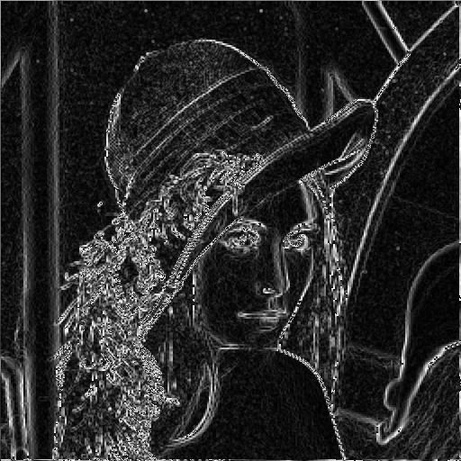

# Image Edge Detection 

Sobel Operator is used for image edge detection. In the sequential version, we iterate on each pixel, whereas on the parallel version each thread corresponds to one pixel on the image. For every pixel, we get calculate the weightet sums %G_x$ and %G_y$, after applying the filters %S_x$ and %S_y$ respectfully, on the neighborhoud of a pixel (i,j). The new pixel will be the norm of the vector $(Gx,Gy)$.

$$
S_x = \begin{bmatrix}
-1 & 0 & 1 \\
-2 & 0 & 2 \\
-1 & 0 & 1
\end{bmatrix} \qquad
S_y = \begin{bmatrix}
-1 & -2 & 1 \\
 0 & 0 & 0 \\
 1 & 2 & 1
\end{bmatrix}
$$

For every pixel $(x,y)$ of the image $f(x,y)$  we calculate:

$$ G_x = \sum_{s=-1}^{1} \sum_{t=-1}^{1} S_x(s+1,t+1)*f(x+s,y+t) $$ 

$$ G_y = \sum_{s=-1}^{1} \sum_{t=-1}^{1} S_y(s+1,t+1)*f(x+s,y+t) $$ 

The new pixel at $(x,y)$ of the new image %g(x,y)$ is the Euclidian norm:

$$ g(x,y) = \lVert (G_x,G_y) \rVert = \sqrt{G_x^2 + G_y^2} $$

The kernel that does this is given below:

```
	__global__ void cudaFindImageEdges(uchar* image, uchar* edgedImage, int imageCols, int imageRows) {
		int i = blockIdx.x;
		int j = blockIdx.y;

		int thread_index = threadIdx.x + blockDim.x * blockIdx.x;

		//Dont let any thread larger than image size enter the kernel
		if (thread_index < imageCols * imageRows) {
			int i = thread_index % imageRows; //column
			int j = thread_index / imageCols; //row
			//Dont work on edges of images
			if (i > 0 && j > 0 && i < imageCols && j < imageRows) {

				int gX = 0;
				int gY = 0;

				//Grab the neighbourhood
				for (int row = -1; row <= 1; row++) {
					for (int col = -1; col <= 1; col++) {
						gX += image[i + row + imageCols * (j + col)] * Sx[row + 1][col + 1];;
						gY += image[i + row + imageCols * (j + col)] * Sy[row + 1][col + 1];;

						//pixel(i,y) = image[i+cols*y]
					
						//This is how we calculated gX and gY in c++ only.
						/*	gX += img.at<uchar>(i + row, j + col) * Sx[row + 1][col + 1];
							gY += img.at<uchar>(i + row, j + col) * Sy[row + 1][col + 1];;*/
					}
				}
				double s = sqrt((float)(gX * gX + gY * gY));
				edgedImage[thread_index] = s;
			}
			else {
				//Edges of the image are just copied to the new image
				edgedImage[thread_index] = image[thread_index];
			}
		}
	}
```

If we apply the sobel operator on the original Lena image, we will get the image with calculated edges as below:

<div>
 
  
</div>


